# Setting Up and Managing SharePoint CEP Project Document Libraries: A Complete Guide Using ShareGate

This guide walks you through the full lifecycle of creating and configuring a new CEP project document library in SharePoint — to ensuring every CEP project carries accurate, consistent metadata. It is written for SharePoint administrators, engineering records managers, and IT staff responsible for provisioning CEP project libraries in response to service requests.

No prior ShareGate experience is required, but familiarity with SharePoint document libraries and basic site navigation is assumed. Access to ShareGate, administrative permissions on both the source and destination SharePoint sites, and an open service request ticket are prerequisites for completing the full workflow described here.

The process covered in this guide reflects a real-world scenario: standing up a new Capital Engineering Project (CEP) document library by copying a template library from an existing site, updating its settings to match the new project, and tagging all documents with the correct metadata fields — Legal Entity, Facility, CEP Project #, and more — before closing the service request.

## What You'll Learn
- How to copy a document library from one SharePoint site to another using ShareGate's Copy structure and content operation
- How to configure ShareGate copy options, including destination title, URL, operation mode, and element selection
- How to monitor a migration in progress and export the migration report upon completion
- How to update a copied library's name, description, and content type settings to reflect the new project
- How to verify that all required columns and metadata fields were carried over correctly
- How to set a default column value (e.g., Legal Entity) in SharePoint Library Settings
- How to bulk-edit metadata across multiple document sets using SharePoint's Bulk edit properties pane
- How to navigate the Engineering Hub and project folder structure after setup is complete

---

## Chapter: Copying content between SharePoint sites using ShareGate

ShareGate makes it straightforward to copy document libraries and their contents from one SharePoint site to another. This chapter walks you through the complete copy process — from selecting your source content to confirming the transfer is complete.

**Step 1:** Open ShareGate and connect to your **source** SharePoint site — the site you want to copy content *from*.

**Step 2:** Navigate to the document library or content you want to copy.

**Step 3:** Select the content you want to transfer, then initiate the copy operation in ShareGate.

**Step 4:** Connect to your **destination** SharePoint site — the site you want to copy content *to*.

**Step 5:** Choose the target location within the destination site where the content should land.

**Step 6:** Start the copy. ShareGate will transfer the selected content from the source site to the destination site.

**Step 7:** Once the operation completes, verify that the content has arrived correctly in the destination site.

> **Note:** The source material for this chapter did not include detailed sub-steps for the ShareGate interface. Refer to your organization's ShareGate documentation or the in-app guidance for specific field values and options during setup.

## Chapter: Copying content between SharePoint sites using ShareGate

This chapter walks you through the full process of copying a SharePoint document library from one site to another using ShareGate — from selecting your source content and configuring copy options, to monitoring the migration and verifying the results in SharePoint.

---

### Start a new copy operation

**Step 1:** Open ShareGate and select **Copy** from the left navigation menu.

**Step 2:** On the "What type of copy would you like to do?" screen, choose **Copy structure and content** under SharePoint and Microsoft 365.

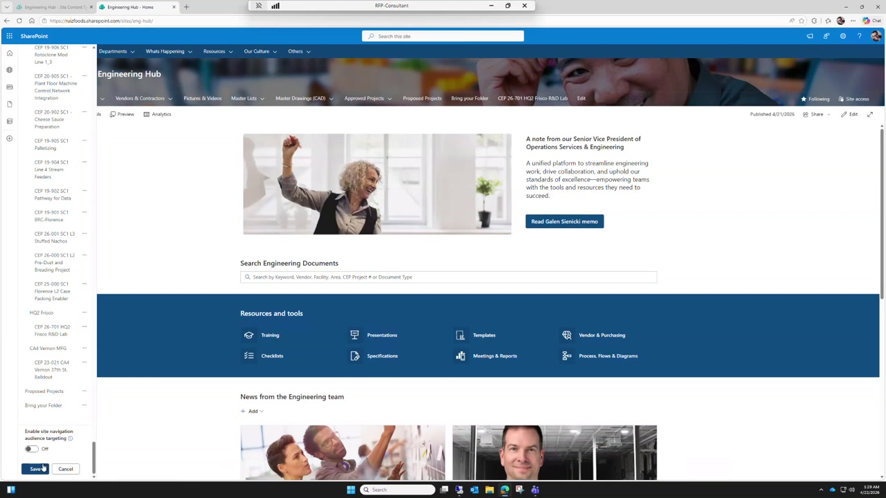

---

### Connect to the destination site

**Step 3:** On the **Select destination** screen, enter the site address for your destination SharePoint site in the **Site address** field. You can also select a previously used address from the dropdown.

**Step 4:** Confirm your authentication details, then click **Connect**.

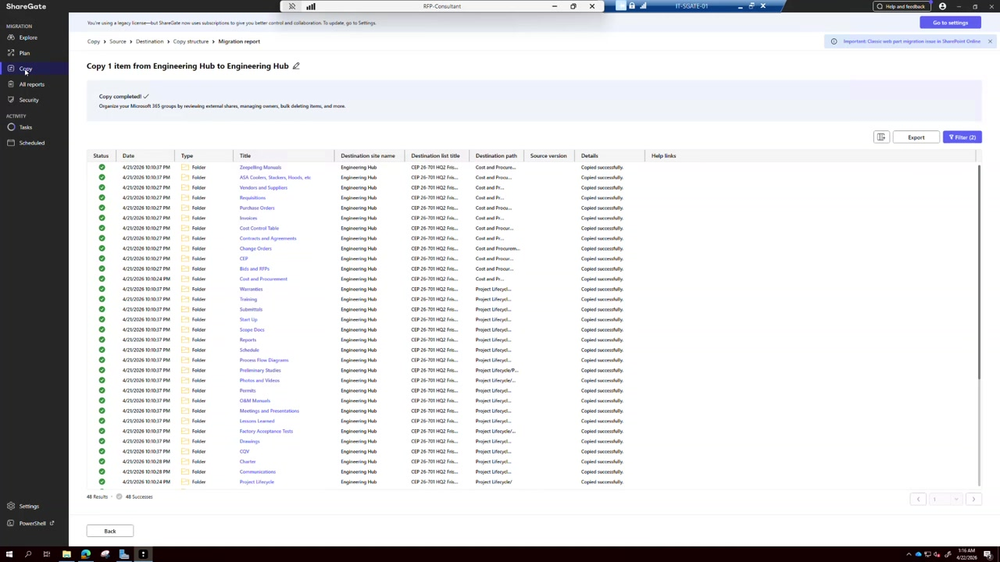

---

### Select the content to copy

**Step 5:** On the **Copy structure** screen, you'll see the source and destination site structures displayed side by side. Browse the folders and libraries and select the item you want to copy (for example, "CEP 09-000 SCI New Project Quick Example").

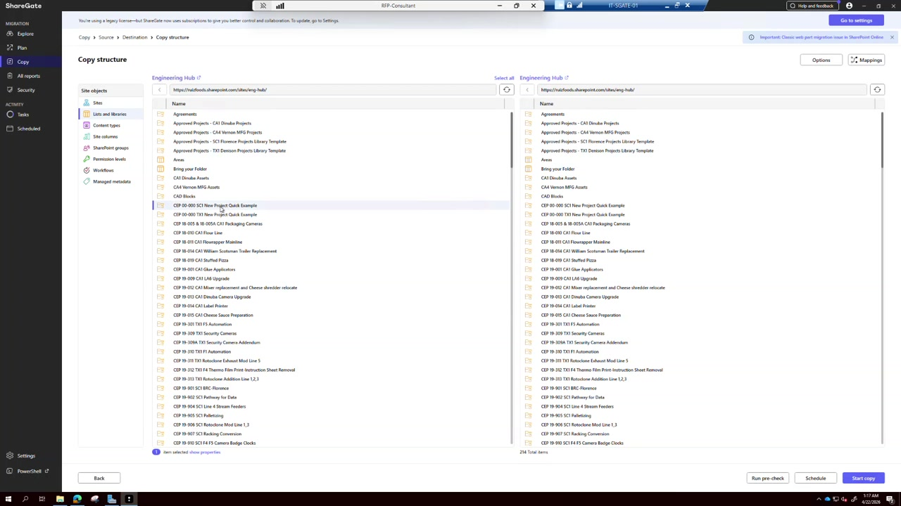

---

### Configure copy options

**Step 6:** Click **Options** to open the Copy options dialog and configure the following settings before starting the copy:

| Setting | Description |
|---|---|
| **New title** | Enter the display name for the destination library (e.g., "CEP 25-701 HQ2 Frisco R&D Lab") |
| **New list address (URL)** | Enter the URL segment for the destination (e.g., "CEP26701HQ2") |
| **Operation mode** | Choose **Automatic** for default behavior or **Manual** to confirm each action |
| **Configurations** | Select which elements to carry over: Custom Permissions, User alerts, List content, Customized list forms, Web parts, List views, Workflows, Required features |
| **Limit to** | Optionally limit to the latest N versions |
| **Modern experience** | Optionally set lists to use the modern experience |
| **Automatic export** | Optionally configure automatic export of migration results |

**Step 7:** Click the checkmark in the upper right of the dialog to save your options.

> **Tip:** If you need to map fields or content types to different values in the destination, click **Mappings** in the upper right of the Copy structure screen before starting.

---

### Run the copy

**Step 8:** Back on the **Copy structure** screen, verify your selections, then click **Start copy** in the lower right.

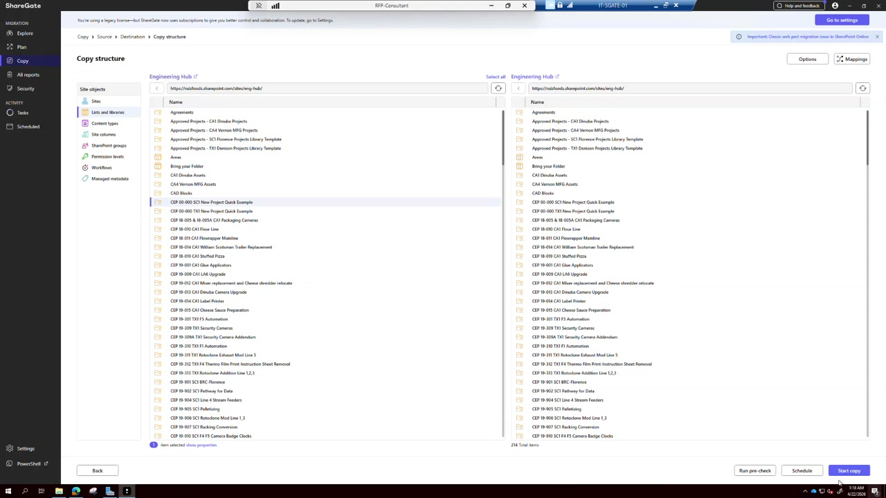

**Step 9:** The Migration report screen opens automatically. You'll initially see a status of "Copying..." and "Initializing..." as the process starts. Items will appear in the table and their statuses will update as the copy progresses.

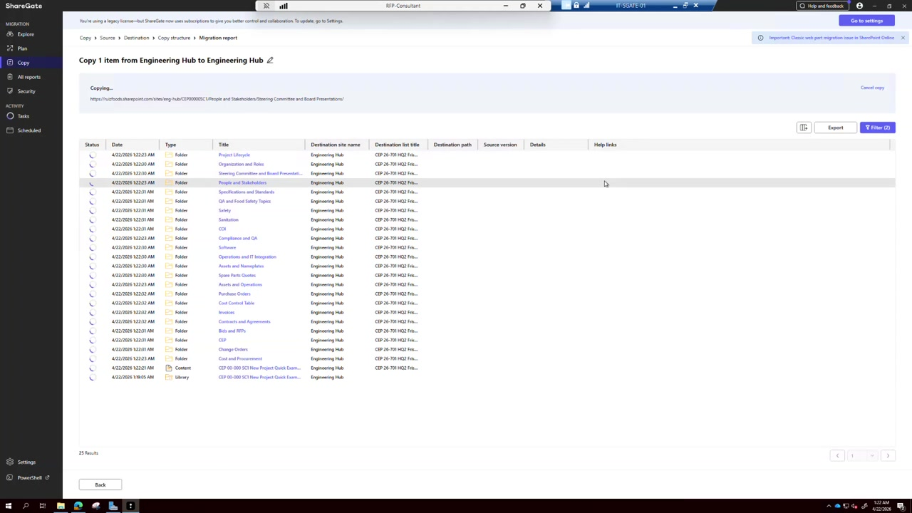

---

### Confirm completion and export the report

**Step 10:** Once the copy finishes, confirm that all items show a green checkmark and "Copied successfully" in the Details column.

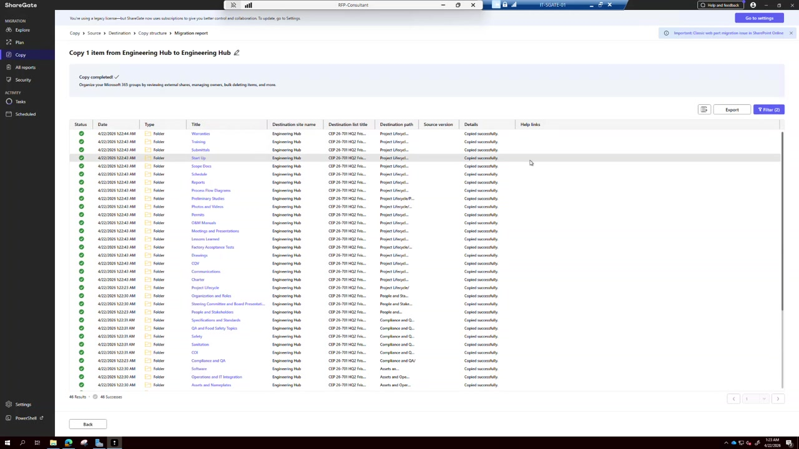

**Step 11:** Click **Export** to save the migration report. In the Save As dialog, choose a destination (such as OneDrive or a local folder), enter a descriptive file name, and click **Save**.

---

### Verify the copied content in SharePoint

**Step 12:** Open the destination SharePoint site and navigate to the document library or folder where the content was copied. Confirm that the titles, document counts, and metadata appear as expected.

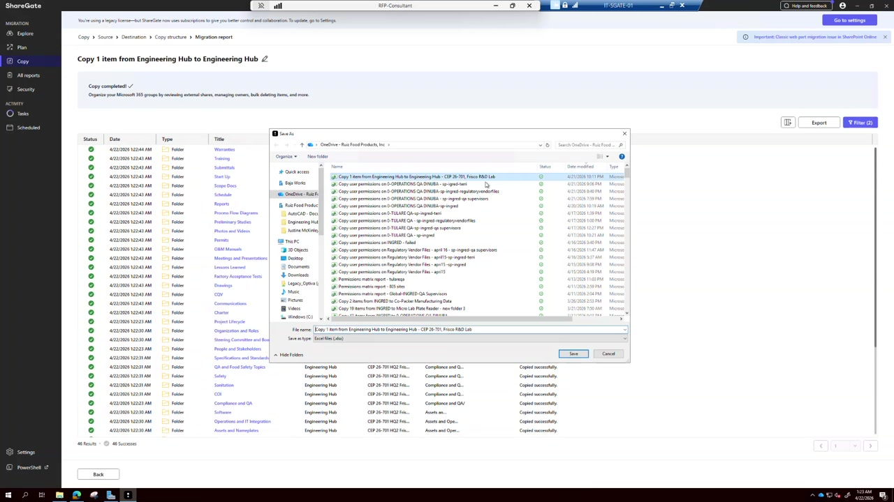

Your content is now successfully copied to the destination site. Next, you'll update the library settings and description to match the service request requirements.

---

### Update library settings and description

After confirming the copy, take a moment to clean up the library settings so the name and description accurately reflect the new project.

**Step 13:** In the destination SharePoint site, open the document library and go to its **Settings** page. Review the details at the top of the page:

- **Name:** The library name copied from the source (e.g., "CEP 26-701 HQ2 Frisco R&D Lab")
- **Description:** This will still show the source library's description and needs to be updated

The settings page also gives you access to General Settings, Permissions and Management options, Content Types, and Columns — all of which were carried over from the source library.

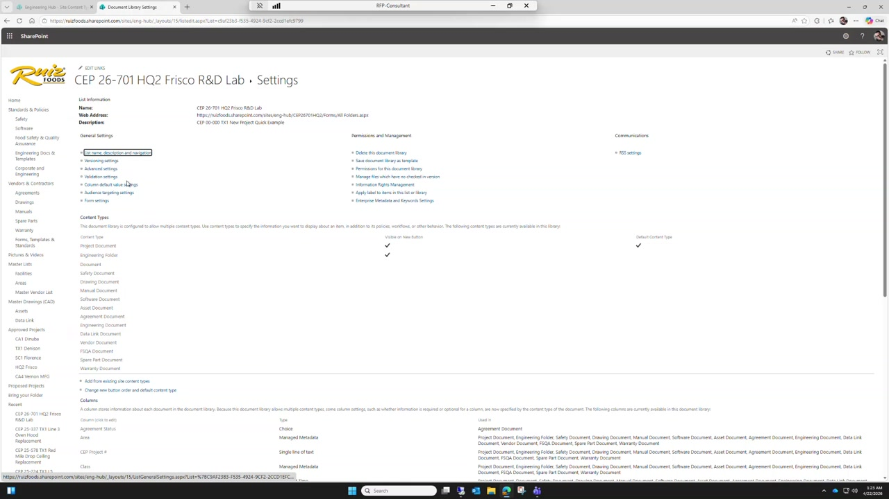

**Step 14:** Click **List name, description and navigation**. Update the **Description** field to reference the ticket that authorized the library creation (for example, "CEP 26-701 HQ2 Frisco R&D Lab created per ticket request 989897"). Click **Save**.

> **Tip:** Before updating the description, open your service request system (e.g., ManageEngine) and locate the relevant ticket to confirm the exact wording and ticket number required.

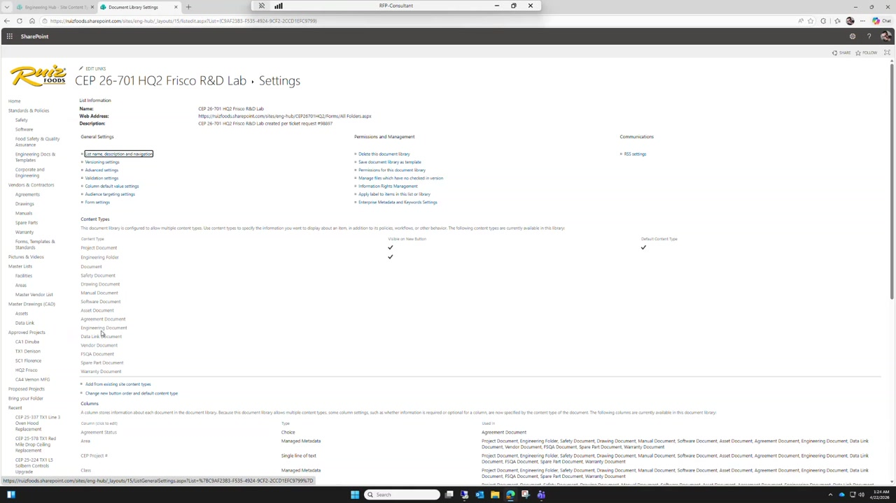

**Step 15:** Back on the settings page, click **Change new button order and default content type**. Review the list of content types, set each one's **Visible** checkbox as needed, and adjust the **Position from Top** order to control how they appear when users create new items. Click **OK** to save.

**Step 16:** Scroll down to the **Columns** section and verify that all required columns are present and correctly configured. Confirm that columns such as Agreement Status, Area, CEP Project #, Class, Date Uploaded, Document Type, EAM Asset #, Expiration Date, Facility, Legal Entity, and Supplier/Vendor are listed and mapped to the appropriate content types.

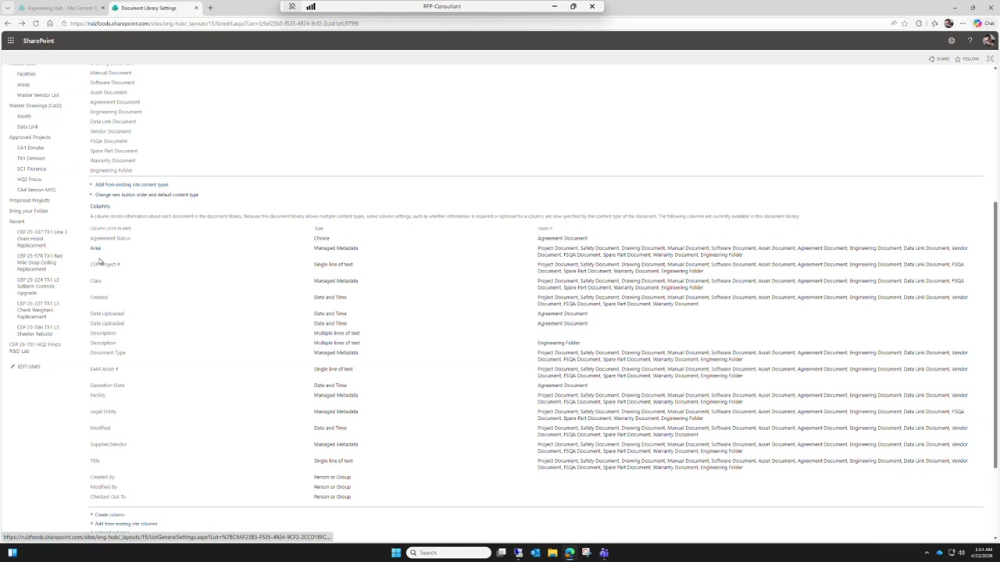

**Step 17:** Return to your service request ticket and confirm that all requirements — library name, description, and configuration — have been met before closing the request.

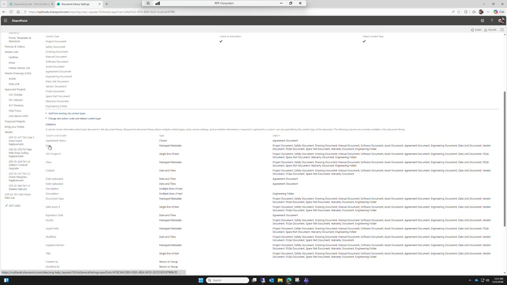

The library is now fully set up and verified against the original request. You're ready to move on to the next step.

## Chapter: Editing document library metadata in SharePoint

Once your document library is set up, you'll want to make sure each document carries the right metadata — legal entity, facility, project number, and more. This chapter walks you through two related tasks: updating a column's default value in library settings, and then bulk-editing metadata across multiple documents at once.

---

### Part 1: Update a column's default value

**Step 1:** Open your SharePoint site and navigate to the document library. Go to **Library Settings** using the settings gear or library menu.

The settings page displays all configured columns — including Agreement Status, Area, Class, Document Type, EAM Asset #, Expiration Date, Facility, Legal Entity, Supplier/Vendor, and others — along with each column's type and the content types that use it.

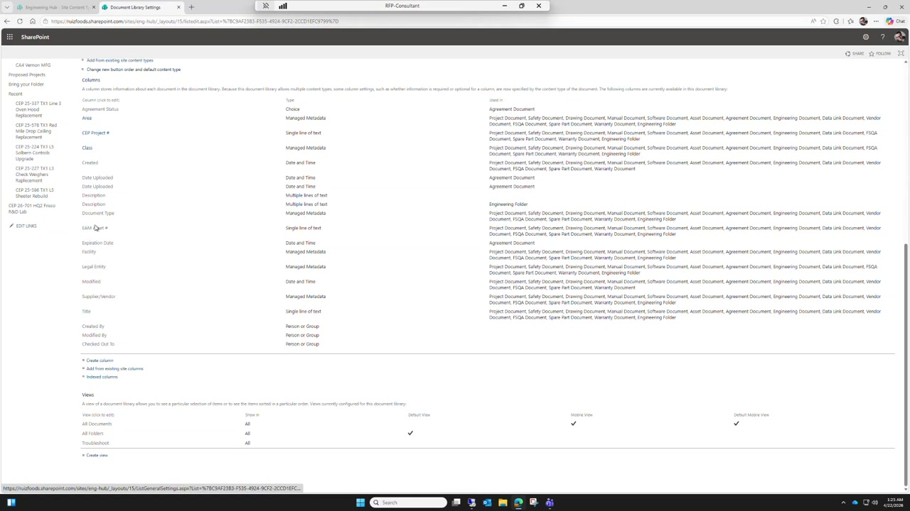

**Step 2:** Scroll through the columns list and click **Legal Entity** to open its settings.

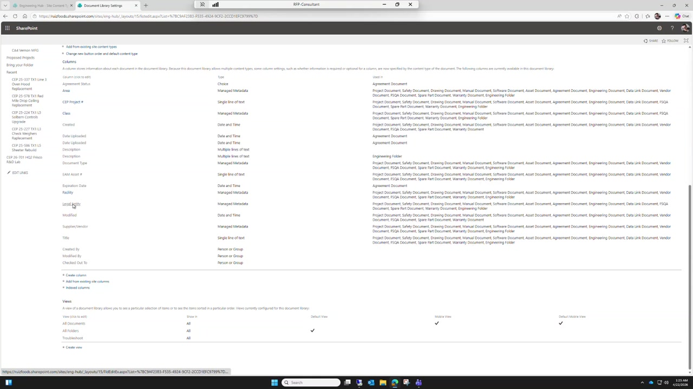

**Step 3:** On the column settings page, you'll see that **Legal Entity** uses a managed term set. A **Select: Default** dialog lists the available entities:
- RG1 Holding Co. LLC (RG1)
- RG4 Holding Company, LLC (RG4)
- Ruiz Food Products, Inc. (RFP)

Select your desired default value — for example, **RG4 Holding Company, LLC (RG4)** — and click **OK**.

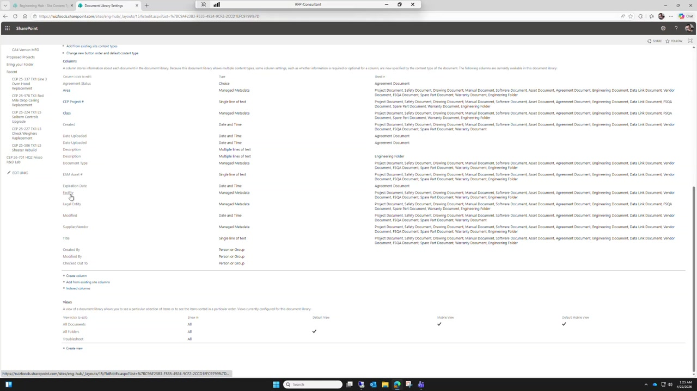

**Step 4:** Review the updated column settings — confirm the correct term set and default value are shown — then click **OK** or **Save** to apply the change. The view returns to the main Library Settings page, confirming the update was saved.

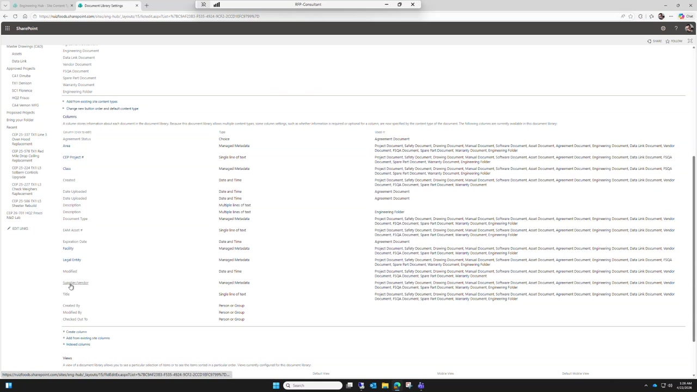

---

### Part 2: Bulk-edit metadata across multiple documents

With column defaults in place, you can now tag multiple documents at once using SharePoint's bulk edit feature.

**Step 1:** Navigate to the document library's list view. You'll see columns such as Name, Title, ID, Facility, Area, Content Type, Document Type, Supplier/Vendor, CEP Project #, EAM Asset #, Legal Entity, and File Size.

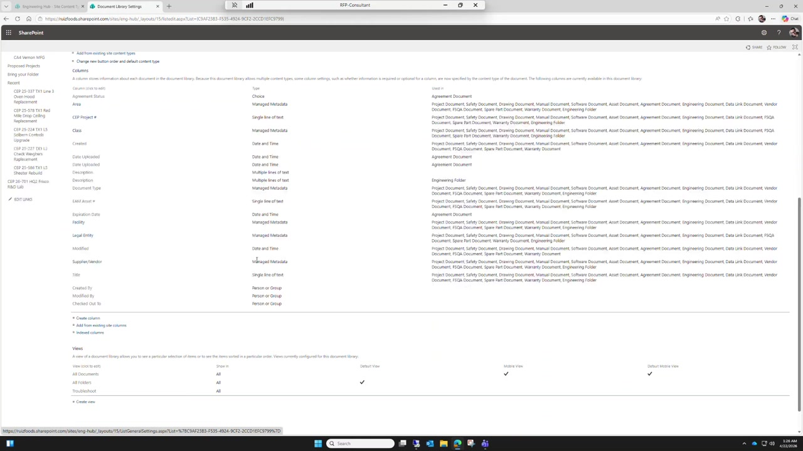

**Step 2:** Check the checkboxes next to the items you want to update. In this example, "Assets and Nameplates" and "Bids and RFPs" are selected. A **Bulk edit properties** pane opens on the right, showing all editable metadata fields: Content Type, Legal Entity, Facility, Area, CEP Project #, Document Type, Class, EAM Asset #, Supplier/Vendor, and Description.

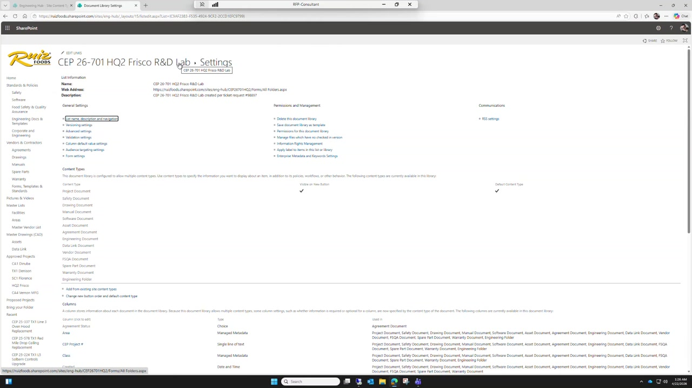

**Step 3:** Fill in the metadata fields in the bulk edit pane:

- **Legal Entity** — Start typing (e.g., "R") and select the correct entity from the suggestions that appear, such as Ruiz Food Products, Inc. (RFP).

  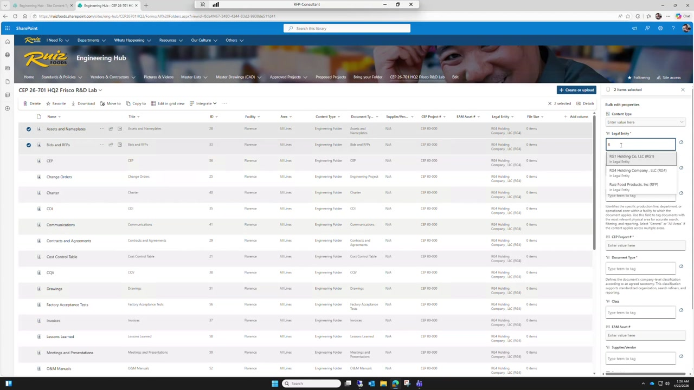

- **Facility** — Type and select **Frisco**.
- **CEP Project #** — Enter **CEP 26-701**.
- Fill in any remaining fields as needed (Document Type, Class, EAM Asset #, Supplier/Vendor, Description).

  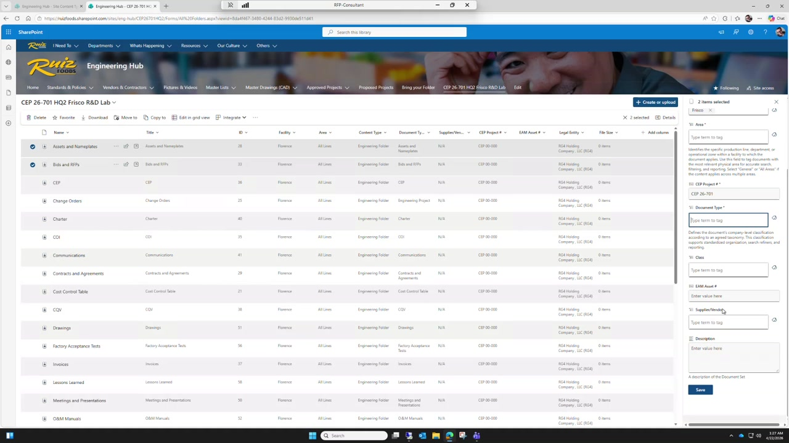

**Step 4:** Click **Save** at the bottom of the bulk edit pane to apply your changes to all selected items at once.

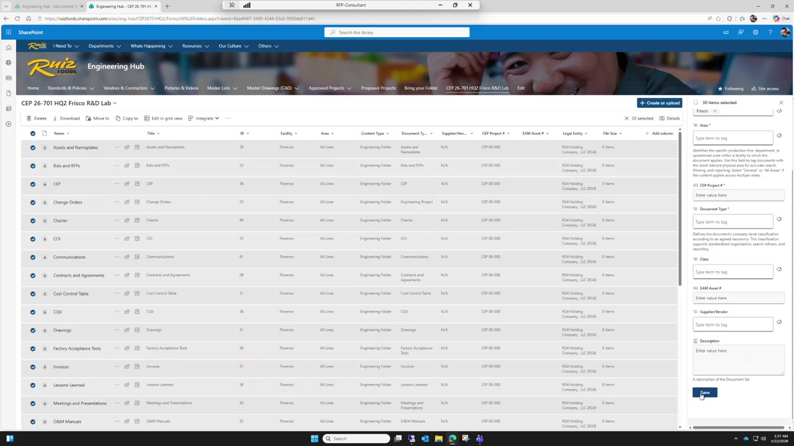

**Step 5:** The library refreshes automatically. Verify that the updated values now appear in the columns for each edited item — for instance, Legal Entity shows "Ruiz Food Products, Inc. (RFP)," Facility shows "Frisco," and CEP Project # shows "CEP 26-701."

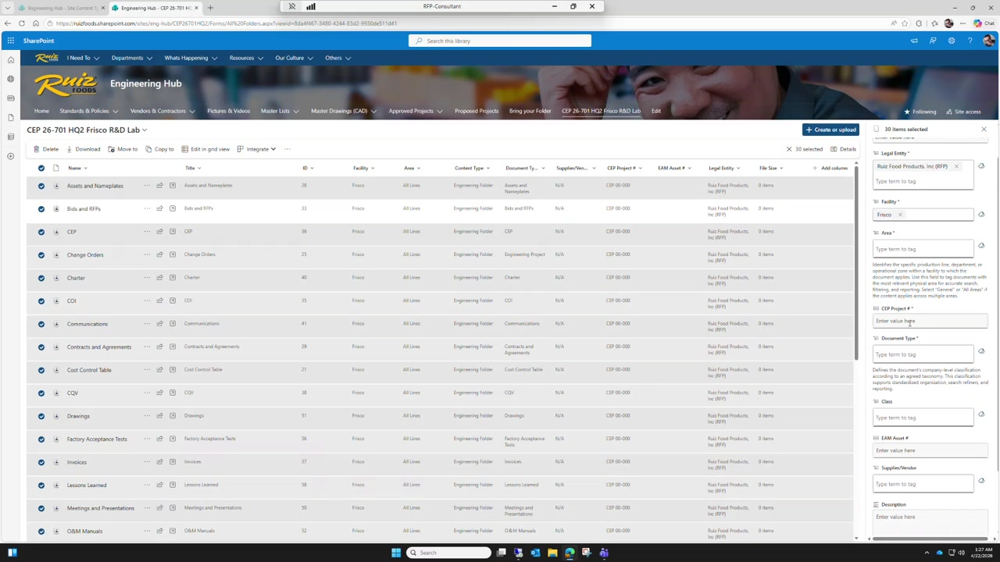

> **Tip:** If you have documents in multiple folders, navigate to each folder and repeat the bulk edit steps to keep metadata consistent across the entire library.

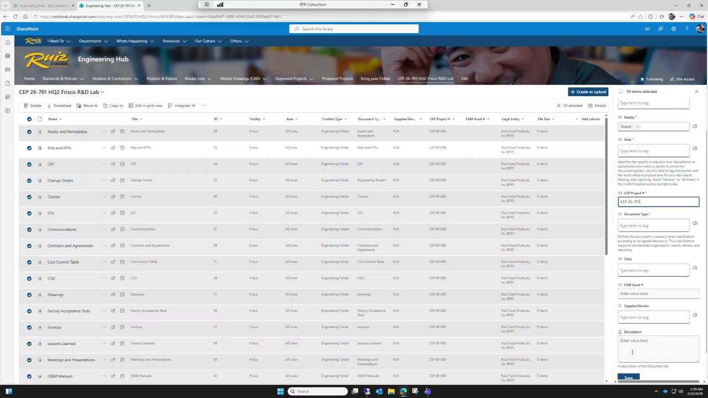

## Chapter: Finalizing Bulk Metadata Edits and Navigating SharePoint Libraries

This chapter walks you through completing a bulk metadata edit across all documents in a project library, saving your changes, and then navigating back to the Engineering Hub and into specific project folders.

---

### Apply metadata to all documents at once

**Step 1:** In the **CEP 26-701 HQ2 Frisco R&D Lab** document library, confirm the **Engineering Project** filter is applied and you can see all items listed (Software, Spare Parts Quotes, Specifications and Standards, Start Up, and others).

**Step 2:** Click the checkbox at the top of the **Name** column to select all items. All rows highlight, and the **Bulk edit properties** pane opens on the right side of the screen.

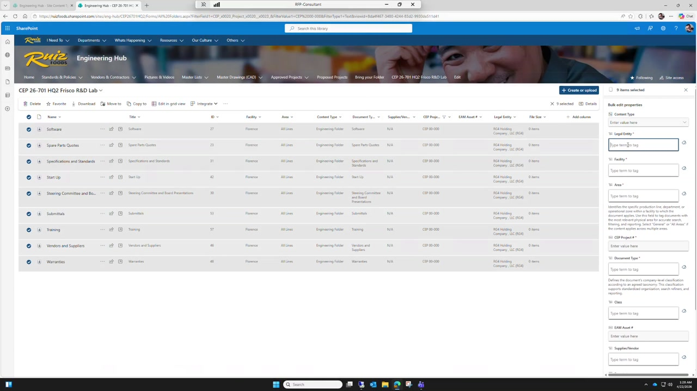

The pane displays these editable fields: Content Type, Legal Entity, Facility, Area, CEP Project #, Document Type, Class, EAM Asset #, Supplier/Vendor, and Description.

**Step 3:** Fill in the following fields in the bulk edit pane:

| Field | Value |
|---|---|
| Legal Entity | Ruiz Food Products, Inc. (RFP) |
| Facility | Frisco |
| CEP Project # | CEP 26-701 |

For each field, type the value and select it from the dropdown when it appears.

**Step 4:** Click **Save** at the bottom of the bulk edit pane. The library refreshes and the updated metadata — Facility, Legal Entity, and CEP Project # — is now visible in the columns for every item.

> **Tip:** After saving, quickly scan the column values for a few rows to confirm the metadata applied correctly before navigating away.

---

### Return to the Engineering Hub and navigate to a project folder

**Step 5:** Navigate back to the **Engineering Hub** home page using the top navigation bar or breadcrumb. The home page includes a welcome banner, a search bar for engineering documents, and quick links to resources such as Training, Presentations, Templates, and Vendor & Purchasing.

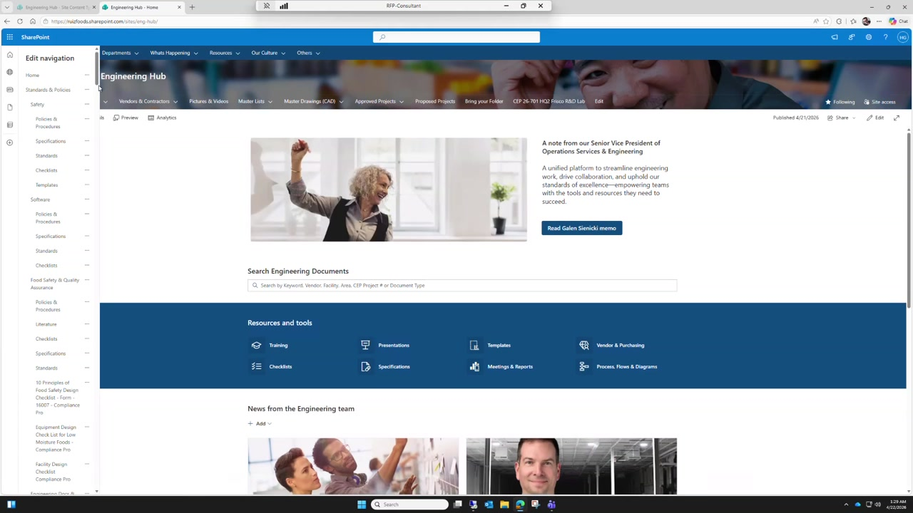

**Step 6:** To go directly back to the project library, hover over **Master Drawing (CAD)** in the top navigation bar, then select **HQ2 Frisco > CEP 26-701 HQ2 Frisco R&D Lab** from the dropdown menu.

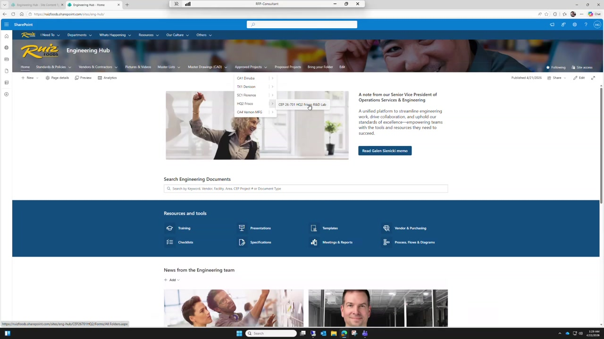

**Step 7:** Once back in the library, switch to the **All Folders** view. You'll see the project's top-level folders, including Asset and Operations, People and Stakeholders, Compliance and QA, Cost and Procurement, and Project Lifecycle. The **Modified** and **Modified By** columns show when each folder was last updated and by whom.

Select any folder — for example, **Asset and Operations** — to open it and view or manage its contents.

> **Note:** If you need to modify the site's navigation structure itself, you can open the site navigation editor from the left menu. This is optional and separate from managing document metadata.

## Chapter: Managing and editing document properties

Once your folders and documents are in place, you can view and update their metadata directly within the SharePoint library. This chapter walks you through reviewing individual folder properties, performing bulk edits across multiple items, and customizing your library view.

---

### Viewing and editing a single folder's properties

**Step 1:** In the **CEP 26-701 HQ2 Frisco R&D Lab** library, click any folder — for example, **Assets and Operations** — to open it.

**Step 2:** Select a subfolder (such as **Software**) by clicking it. The right pane displays the folder's metadata fields, including:

| Field | Example value |
|---|---|
| Content Type | Engineering Folder |
| Legal Entity | Ruiz Food Products, Inc (RFP) |
| Facility | Frisco |
| Area | All Lines |
| CEP Project # | CEP 26-701 |
| Document Type | Software |
| Supplier/Vendor | N/A |
| Description | Software licenses and configurations |

The activity log at the bottom of the pane shows recent edits and creations for that folder.

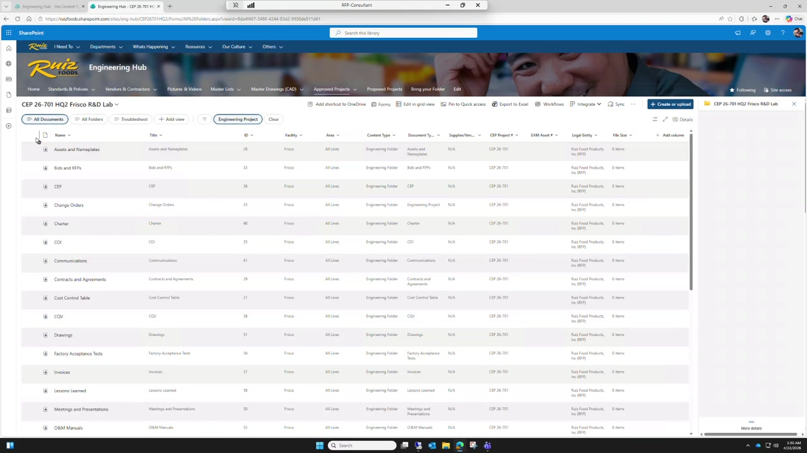

**Step 3:** To update the metadata, click **Edit all** or the pencil icon in the properties pane. Update fields such as **Class**, **EAM Asset #**, or **Description** as needed, then click **Save**.

---

### Bulk editing properties across multiple items

If you need to apply the same metadata values to several folders at once, bulk editing saves significant time.

**Step 1:** Return to the main document library view. Use the checkboxes to select multiple folders or documents (for example, **Assets and Nameplates**, **Bids and RFPs**, **CEP**, and others).

**Step 2:** The right pane updates to show **Bulk edit properties**. The same metadata fields are available — Content Type, Legal Entity, Facility, Area, CEP Project #, Document Type, Class, EAM Asset #, Supplier/Vendor, and Description — and any value you enter will be applied to all selected items.

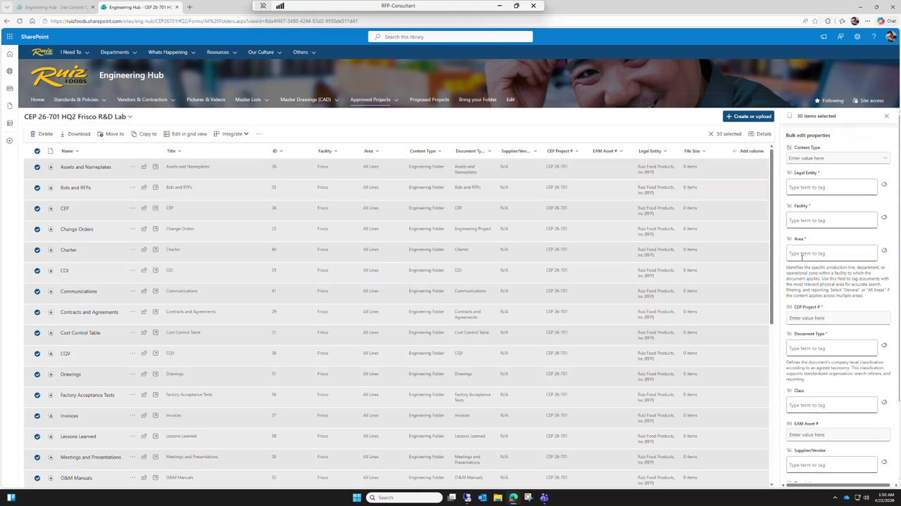

**Step 3:** Scroll through the library to confirm all the items you want to update are selected.

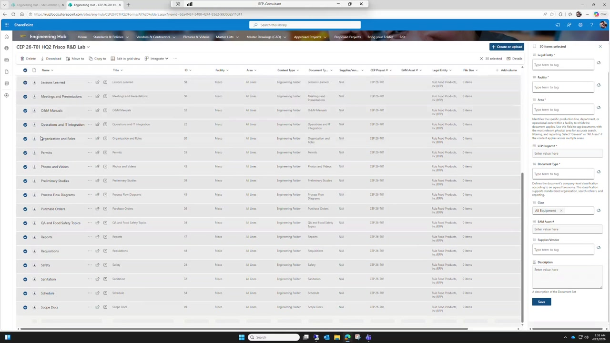

**Step 4:** Enter the desired values in the bulk edit pane, then click **Save** at the bottom of the pane to apply the changes to all selected items.

---

### Filtering and navigating the library

**Step 1:** To focus on documents for a specific location, use the filter dropdown in the **Facility** column. Available options include facilities such as CA1 Dinuba, TX1 Denison, SC1 Florence, HQ2 Frisco, and C4 Vernon MFG.

**Step 2:** To return to the Engineering Hub home page at any time, click the **Engineering Hub** link in the navigation bar. From there you can access the welcome note, search bar, quick links, and team news.

**Step 3:** From the main library view, you can navigate to any of the top-level folders — **Assets and Operations**, **People and Stakeholders**, **Compliance and QA**, **Cost and Procurement**, and **Project Lifecycle**. Each folder displays its last modified date and the user who modified it.

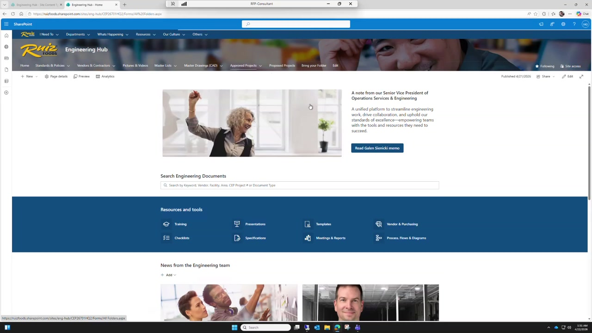

---

### Adding custom columns to your library

If the default metadata fields don't cover everything your team needs, you can extend the library with additional columns.

**Step 1:** In the main library view, click **Add column** to create a new metadata field.

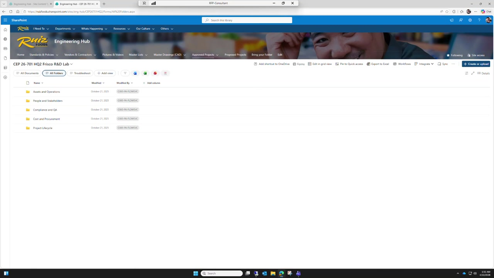

> **Tip:** Adding custom columns lets you tailor the library view to your team's specific tracking and reporting needs.

With your metadata in order and your library customized, your engineering documents are properly categorized and easy to find across all facilities and project types.

---

## Frequently Asked Questions

**Q: What copy type should I select in ShareGate when setting up a new project library?**
A: Select **Copy structure and content** under the SharePoint and Microsoft 365 section on the "What type of copy would you like to do?" screen. This option carries over the library's structure along with its content, including content types, columns, permissions, and list views, depending on what you select in the Copy options dialog.

**Q: Where do I set the destination library's display name and URL during the ShareGate copy?**
A: Click **Options** on the Copy structure screen before starting the copy. In the Copy options dialog, enter the display name in the **New title** field (e.g., "CEP 25-701 HQ2 Frisco R&D Lab") and the URL segment in the **New list address (URL)** field (e.g., "CEP25-701HQ200005C1").

**Q: How do I confirm the migration completed successfully, and how do I save the results?**
A: On the Migration report screen, confirm that all items show a green checkmark and "Copied successfully" in the Details column. Then click **Export**, choose a save location such as OneDrive or a local folder, enter a descriptive file name, and click **Save**.

**Q: After the library is copied, what settings need to be updated to reflect the new project?**
A: At minimum, update the library's **Description** via **List name, description and navigation** in Library Settings to reference the service request ticket that authorized the library creation. You should also review the content type visibility and order under **Change new button order and default content type**, and verify that all required columns (e.g., Agreement Status, CEP Project #, Legal Entity, Facility) are present and correctly configured.

**Q: How do I set a default value for the Legal Entity column so new documents are pre-tagged?**
A: In Library Settings, click the **Legal Entity** column to open its settings. A **Select: Default** dialog will appear listing the available managed term set values. Select the appropriate entity (e.g., RG4 Holding Company, LLC) and click **OK**, then save the column settings.

**Q: Can I update metadata on multiple documents at the same time, or do I have to edit them one by one?**
A: You can bulk-edit metadata across multiple items simultaneously. In the document library's list view, check the checkboxes next to the items you want to update — or click the checkbox at the top of the Name column to select all items. The **Bulk edit properties** pane opens on the right, where you can fill in fields such as Legal Entity, Facility, and CEP Project # and click **Save** to apply the values to all selected items at once.

**Q: What should I do if documents are organized across multiple folders and need the same metadata applied?**
A: Navigate to each folder separately and repeat the bulk edit steps within each one. Bulk edits apply only to the items currently visible and selected in your view, so you must perform the operation folder by folder to ensure metadata is consistent across the entire library.

**Q: How do I add a metadata field that isn't already included in the library?**
A: From the main library view, click **Add column** to create a new metadata field. This lets you extend the library with additional columns tailored to your team's specific tracking and reporting needs.